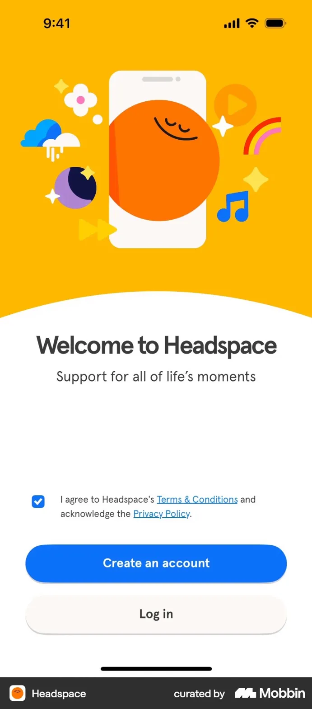
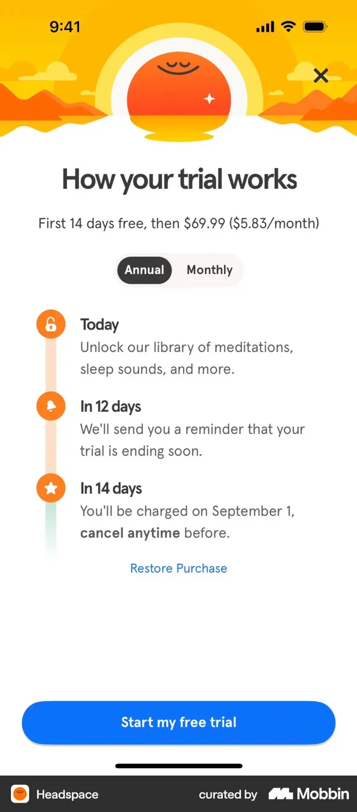

# Headspace Onboarding Screens - Implementation Plan (Audited)

**Version:** 2.1 (Audited from screenshots + Expo Skills)  
**Target:** Expo + React Native (New Architecture)  
**Font:** Hanken Grotesk (configured in `app/_layout.tsx`)

---

## ⚠️ CRITICAL: Expo Development Guidelines

> [!CAUTION]
> **Read this section carefully before implementation.** These guidelines are extracted from the installed Expo skills and must be followed to avoid common mistakes.

### Running the App

1. **Always try Expo Go first** - Run `npx expo start` and scan QR code
2. Only create custom builds (`npx expo run:ios`) when using local native modules
3. Most features work in Expo Go without custom native code

### Library Preferences (NEVER use these)

| ❌ DON'T USE | ✅ USE INSTEAD |
|--------------|----------------|
| `expo-av` | `expo-audio` / `expo-video` |
| `@expo/vector-icons` | `expo-symbols` (SF Symbols) |
| `expo-symbols` (old) | `expo-image` with `source="sf:name"` |
| `SafeAreaView` from react-native | `react-native-safe-area-context` |
| `AsyncStorage` from react-native | `@react-native-async-storage/async-storage` |
| `Picker` from react-native | `@react-native-picker/picker` |
| `Platform.OS` | `process.env.EXPO_OS` |
| `React.useContext` | `React.use` |
| `StyleSheet.create` (for one-off styles) | Inline styles |
| Intrinsic elements (`img`, `div`) | React Native components |
| FontAwesome / Ionicons | SF Symbols via `expo-symbols` |

### Code Style Rules

- **File names**: Always use `kebab-case` (e.g., `floating-icons.tsx`)
- **Routes**: Belong in `app/` directory only - never co-locate components there
- **Imports**: Use path aliases (`@/components`) over relative imports
- **Strings**: Be cautious of unterminated strings - escape nested backticks

### Styling Rules

| Rule | Implementation |
|------|----------------|
| Border corners | `{ borderCurve: 'continuous' }` for rounded corners (not capsules) |
| Shadows | `{ boxShadow: "0 1px 2px rgba(0,0,0,0.05)" }` - NEVER use elevation |
| Layout | Prefer `gap` over `margin`/`padding` for spacing |
| Safe area | Use `contentInsetAdjustmentBehavior="automatic"` on ScrollView |
| Counters | `{ fontVariant: 'tabular-nums' }` for number alignment |
| Text | Add `selectable` prop for copyable content |

### Gradients

> [!WARNING]  
> CSS gradients require **New Architecture (Fabric)** - not available in Expo Go!

```tsx
// Use experimental_backgroundImage (New Arch only)
<View style={{
  experimental_backgroundImage: 'linear-gradient(to bottom, #FFD966 0%, #FF8C42 100%)'
}} />

// ❌ Do NOT use expo-linear-gradient
```

**Fallback for Expo Go**: Use solid colors or `expo-linear-gradient` temporarily during development, then switch to CSS gradients for production builds.

### Animations (Reanimated v4) - Calmness Philosophy

> [!CAUTION]
> **CLIENT PRIORITY**: This is a meditation/wellness app. All animations must feel **gentle, smooth, and calming**. Never use jarring, fast, or bouncy animations. The app should feel like a deep breath.

#### Animation Timing Guidelines

| Animation Type | Duration | Easing | Notes |
|----------------|----------|--------|-------|
| **Button press** | 150-200ms | `Easing.out(Easing.ease)` | Quick but soft feedback |
| **State change (text/content)** | 300-400ms | `Easing.out(Easing.ease)` | Gentle fade/morph |
| **Screen transition** | 400-500ms | `Easing.inOut(Easing.ease)` | Slow and smooth |
| **Micro-interaction** | 200-300ms | `Easing.out(Easing.ease)` | Subtle acknowledgment |
| **Ambient animation (breathing)** | 3000-5000ms | `Easing.inOut(Easing.ease)` | Very slow, meditative |
| **Floating icons** | 4000-7000ms | `Easing.inOut(Easing.ease)` | Hypnotic, slow drift |

#### Spring Physics Presets (Calm)

```tsx
// constants/animations.ts

// ❌ DON'T USE - Too bouncy/jarring for wellness app
const BOUNCY_SPRING = { damping: 10, stiffness: 400 };

// ✅ USE - Calm, gentle, controlled
export const CALM_SPRING = { 
  damping: 20,      // High damping = less bounce
  stiffness: 150,   // Low stiffness = slower response
  mass: 1,
};

// ✅ USE - For very subtle movements
export const GENTLE_SPRING = { 
  damping: 25, 
  stiffness: 100, 
  mass: 1,
};

// ✅ USE - For button feedback (slightly more responsive)
export const BUTTON_SPRING = { 
  damping: 18, 
  stiffness: 200, 
  mass: 0.8,
};
```

#### State Change Animation Patterns

```tsx
import Animated, { 
  FadeIn, 
  FadeOut, 
  FadeInUp,
  FadeOutDown,
  LinearTransition,
  Easing,
} from 'react-native-reanimated';

// ✅ Content that changes based on state (e.g., pricing when toggle switches)
<Animated.View
  key={stateKey}  // Key change triggers animation
  entering={FadeIn.duration(400).easing(Easing.out(Easing.ease))}
  exiting={FadeOut.duration(200)}
  layout={LinearTransition.duration(300)}
/>

// ✅ List items appearing
<Animated.View
  entering={FadeInUp.duration(400).delay(index * 80).easing(Easing.out(Easing.ease))}
  exiting={FadeOutDown.duration(200)}
/>

// ✅ Ambient breathing animation for character
const breathingStyle = useAnimatedStyle(() => ({
  transform: [{
    scale: withRepeat(
      withSequence(
        withTiming(1.03, { duration: 2000, easing: Easing.inOut(Easing.ease) }),
        withTiming(1.0, { duration: 2000, easing: Easing.inOut(Easing.ease) })
      ),
      -1, // Infinite repeat
      false
    )
  }]
}));
```

#### Rules for Calmness

1. **No abrupt movements** - Everything should ease in and out
2. **Longer durations** - Use 300-500ms instead of typical 150-200ms
3. **High damping springs** - Damping ≥ 18 to prevent bouncing
4. **Stagger list animations** - 80-100ms delays between items
5. **Ambient loops should be slow** - 3-7 seconds for breathing/floating
6. **Exit animations faster than enter** - Exit at 50-70% of enter duration
7. **Use opacity for state changes** - Fade > Slide for content swaps
8. **Consistent timing** - All similar interactions should feel the same

---

### Screen Intro & Transition Animations

> [!IMPORTANT]
> **Screen Entry Choreography**: Each screen should have a carefully planned intro animation sequence where elements appear in a logical, visually pleasing order.

#### Welcome Screen Intro Sequence

When the app first loads, elements should fade/float in with staggered timing:

| Order | Element | Animation | Delay | Duration |
|-------|---------|-----------|-------|----------|
| 1 | Yellow background | Already visible | 0ms | — |
| 2 | Phone frame | `FadeIn` + `scale(0.95→1)` | 0ms | 600ms |
| 3 | Orange character | `FadeIn` + start breathing | 200ms | 500ms |
| 4 | Floating icons | `FadeIn` + start floating (staggered) | 300-600ms | 400ms each |
| 5 | White content area | `FadeInUp` | 400ms | 500ms |
| 6 | "Welcome to Headspace" | `FadeIn` | 600ms | 400ms |
| 7 | Subtitle | `FadeIn` | 700ms | 400ms |
| 8 | Checkbox | `FadeIn` | 800ms | 300ms |
| 9 | Buttons | `FadeInUp` (staggered) | 900ms, 1000ms | 400ms |

```tsx
// Welcome screen intro orchestration
function WelcomeScreen() {
  return (
    <View style={styles.container}>
      {/* Phone + Character - immediate */}
      <Animated.View 
        entering={FadeIn.duration(600).easing(Easing.out(Easing.ease))}
      >
        <PhoneFrame>
          <Animated.View entering={FadeIn.delay(200).duration(500)}>
            <Character />
          </Animated.View>
        </PhoneFrame>
      </Animated.View>

      {/* Floating icons - staggered */}
      {icons.map((icon, i) => (
        <Animated.View
          key={icon.id}
          entering={FadeIn.delay(300 + i * 100).duration(400)}
        >
          <FloatingIcon {...icon} />
        </Animated.View>
      ))}

      {/* Content section */}
      <Animated.View entering={FadeInUp.delay(400).duration(500)}>
        <Animated.Text entering={FadeIn.delay(600).duration(400)}>
          Welcome to Headspace
        </Animated.Text>
        <Animated.Text entering={FadeIn.delay(700).duration(400)}>
          Support for all of life's moments
        </Animated.Text>
        
        <Animated.View entering={FadeIn.delay(800).duration(300)}>
          <Checkbox />
        </Animated.View>

        <Animated.View entering={FadeInUp.delay(900).duration(400)}>
          <PrimaryButton>Create an account</PrimaryButton>
        </Animated.View>
        <Animated.View entering={FadeInUp.delay(1000).duration(400)}>
          <SecondaryButton>Log in</SecondaryButton>
        </Animated.View>
      </Animated.View>
    </View>
  );
}
```

#### Welcome → Paywall Transition

When user taps "Create an account", the Paywall screen should appear as a **modal sheet rising from bottom**:

```tsx
// app/_layout.tsx
<Stack>
  <Stack.Screen name="index" options={{ headerShown: false }} />
  <Stack.Screen 
    name="paywall" 
    options={{
      presentation: 'formSheet',        // iOS modal presentation
      sheetGrabberVisible: true,        // Grabber bar at top
      sheetAllowedDetents: [1.0],       // Full height only
      animation: 'slide_from_bottom',   // Android fallback
      animationDuration: 500,           // Calm, slow transition
      gestureEnabled: true,             // Swipe to dismiss
    }} 
  />
</Stack>
```

**Transition timing**: 500ms slide up with `Easing.out(Easing.ease)` - feels like a gentle rising breath.

#### Paywall Screen Intro Sequence

After the sheet rises, internal elements animate in:

| Order | Element | Animation | Delay | Duration |
|-------|---------|-----------|-------|----------|
| 1 | Sunset gradient | Already visible | 0ms | — |
| 2 | Sun character | `FadeIn` + start breathing | 0ms | 500ms |
| 3 | Close button (X) | `FadeIn` | 200ms | 300ms |
| 4 | Title | `FadeIn` | 300ms | 400ms |
| 5 | Pricing text | `FadeIn` | 400ms | 400ms |
| 6 | Toggle | `FadeIn` | 500ms | 300ms |
| 7 | Timeline items | `FadeInLeft` (staggered) | 600, 700, 800ms | 400ms each |
| 8 | Restore Purchase link | `FadeIn` | 900ms | 300ms |
| 9 | CTA Button | `FadeInUp` | 1000ms | 400ms |

```tsx
// Paywall screen intro orchestration
function PaywallScreen() {
  return (
    <View style={styles.container}>
      {/* Header */}
      <SunsetHeader>
        <Animated.View entering={FadeIn.duration(500)}>
          <SunCharacter />
        </Animated.View>
        <Animated.View entering={FadeIn.delay(200).duration(300)}>
          <CloseButton />
        </Animated.View>
      </SunsetHeader>

      {/* Content */}
      <Animated.Text entering={FadeIn.delay(300).duration(400)}>
        How your trial works
      </Animated.Text>
      
      <Animated.View entering={FadeIn.delay(400).duration(400)}>
        <PricingText />
      </Animated.View>

      <Animated.View entering={FadeIn.delay(500).duration(300)}>
        <BillingToggle />
      </Animated.View>

      {/* Timeline - staggered */}
      {timelineItems.map((item, i) => (
        <Animated.View
          key={item.id}
          entering={FadeInLeft.delay(600 + i * 100).duration(400)}
        >
          <TimelineItem {...item} />
        </Animated.View>
      ))}

      <Animated.Text entering={FadeIn.delay(900).duration(300)}>
        Restore Purchase
      </Animated.Text>

      <Animated.View entering={FadeInUp.delay(1000).duration(400)}>
        <PrimaryButton>Start my free trial</PrimaryButton>
      </Animated.View>
    </View>
  );
}
```

#### Paywall Dismiss Transition

When user taps X or swipes down:
- **Duration**: 400ms
- **Animation**: Slide down with fade
- **Easing**: `Easing.in(Easing.ease)` - accelerates as it leaves

```tsx
// Dismissing the paywall
const router = useRouter();

const handleClose = () => {
  Haptics.impactAsync(Haptics.ImpactFeedbackStyle.Light);
  router.back();  // Uses native sheet dismiss animation
};
```

#### Navigation Configuration Summary

```tsx
// app/_layout.tsx - Complete navigation setup for calm transitions
import { Stack } from 'expo-router/stack';

export default function RootLayout() {
  return (
    <Stack
      screenOptions={{
        headerShown: false,
        animation: 'fade',
        animationDuration: 400,
        gestureEnabled: true,
        gestureDirection: 'vertical',
      }}
    >
      <Stack.Screen name="index" />
      <Stack.Screen 
        name="paywall" 
        options={{
          presentation: 'formSheet',
          sheetGrabberVisible: true,
          sheetAllowedDetents: [1.0],
        }} 
      />
    </Stack>
  );
}
```


### Icons (SF Symbols)

```tsx
import { SymbolView } from 'expo-symbols';
import { PlatformColor } from 'react-native';

// ✅ Correct way
<SymbolView
  name="checkmark.circle.fill"
  tintColor={PlatformColor('label')}
  size={24}
  weight="medium"
/>

// Common icons for this project:
// - xmark (close button)
// - lock.open (Today timeline)
// - bell (12 days timeline)
// - star.fill (14 days timeline)
// - checkmark (checkbox)
```

### Native Controls

For the Annual/Monthly toggle, consider using native SegmentedControl:

```tsx
import SegmentedControl from '@react-native-segmented-control/segmented-control';

<SegmentedControl
  values={['Annual', 'Monthly']}
  selectedIndex={index}
  onChange={({ nativeEvent }) => setIndex(nativeEvent.selectedSegmentIndex)}
/>
```

> [!TIP]
> Native controls have built-in haptics and automatically adapt to dark mode.

### Navigation

- Use `_layout.tsx` files to define stacks
- Use `Stack` from `expo-router/stack`
- Set page titles via `Stack.Screen options={{ title: "..." }}`
- Prefer `presentation: "formSheet"` for modals with grabber

---

## Design Screenshots Reference

| Welcome Screen | Paywall Screen |
|----------------|----------------|
|  |  |

---

## Color Palette (Extracted from Screenshots)

```typescript
// constants/colors.ts
export const Colors = {
  // Welcome Screen
  yellowBackground: '#FFAA00',      // Vibrant yellow-orange background
  
  // Paywall Screen - Sunset Gradient
  sunsetTop: '#B8D4A8',             // Sage/mint green at very top
  sunsetYellow: '#FFD966',          // Golden yellow
  sunsetOrange: '#FFB347',          // Warm orange
  sunsetDeep: '#FF8C42',            // Deep orange at horizon
  
  // UI Colors
  bluePrimary: '#2563EB',           // Primary CTA button 
  blueLink: '#3B82F6',              // Text links (Terms, Restore Purchase)
  
  // Backgrounds
  white: '#FFFFFF',
  cream: '#FEFEFE',                 // Off-white content background
  
  // Text
  textPrimary: '#1F2937',           // Main headings
  textSecondary: '#6B7280',         // Subtitle and body text
  
  // Character
  orangeCharacter: '#FF6B35',       // Orange character/sun gradient start
  orangeCharacterDark: '#E85A28',   // Character gradient end
  
  // Timeline Icons
  timelineBlue: '#3B82F6',          // Lock icon (Today)
  timelineOrange: '#F97316',        // Bell icon (In 12 days)
  timelineYellow: '#FBBF24',        // Star icon (In 14 days)
  timelineLine: '#D1FAE5',          // Light green connecting line
  
  // Toggle
  toggleBackground: '#E5E7EB',      // Gray pill background
  toggleActive: '#1F2937',          // Dark active state
  
  // Close button
  closeBackground: 'rgba(0,0,0,0.15)',
} as const;
```

---

## Typography (Hanken Grotesk)

```typescript
// constants/typography.ts
export const Typography = {
  // Welcome Screen
  welcomeTitle: {
    fontFamily: 'HankenGrotesk-Bold',
    fontSize: 32,
    lineHeight: 40,
    color: '#1F2937',
  },
  welcomeSubtitle: {
    fontFamily: 'HankenGrotesk-Regular',
    fontSize: 17,
    lineHeight: 24,
    color: '#6B7280',
  },
  
  // Paywall Screen
  paywallTitle: {
    fontFamily: 'HankenGrotesk-Bold',
    fontSize: 28,
    lineHeight: 34,
    color: '#1F2937',
  },
  paywallSubtitle: {
    fontFamily: 'HankenGrotesk-Regular',
    fontSize: 15,
    lineHeight: 22,
    color: '#6B7280',
  },
  
  // Timeline
  timelineTitle: {
    fontFamily: 'HankenGrotesk-SemiBold',
    fontSize: 16,
    lineHeight: 22,
    color: '#1F2937',
  },
  timelineDescription: {
    fontFamily: 'HankenGrotesk-Regular',
    fontSize: 14,
    lineHeight: 20,
    color: '#6B7280',
  },
  
  // Buttons
  buttonPrimary: {
    fontFamily: 'HankenGrotesk-SemiBold',
    fontSize: 17,
    color: '#FFFFFF',
  },
  buttonSecondary: {
    fontFamily: 'HankenGrotesk-Medium',
    fontSize: 17,
    color: '#1F2937',
  },
  
  // Links
  link: {
    fontFamily: 'HankenGrotesk-Medium',
    fontSize: 14,
    color: '#3B82F6',
  },
  
  // Toggle
  toggleActive: {
    fontFamily: 'HankenGrotesk-SemiBold',
    fontSize: 14,
    color: '#FFFFFF',
  },
  toggleInactive: {
    fontFamily: 'HankenGrotesk-Medium',
    fontSize: 14,
    color: '#6B7280',
  },
  
  // Checkbox label
  checkboxLabel: {
    fontFamily: 'HankenGrotesk-Regular',
    fontSize: 13,
    lineHeight: 18,
    color: '#6B7280',
  },
} as const;
```

---

## Component Interaction States

> [!IMPORTANT]
> All interactive components must have defined states for solid client handoff. These states ensure consistent UX across all touch interactions.

### Primary Button (Create an account / Start my free trial)

| State | Background | Text Color | Shadow | Scale | Opacity |
|-------|------------|------------|--------|-------|---------|
| **Default** | `#2563EB` | `#FFFFFF` | `0 4px 12px rgba(37,99,235,0.25)` | 1.0 | 1.0 |
| **Pressed** | `#1D4ED8` | `#FFFFFF` | `0 2px 6px rgba(37,99,235,0.2)` | 0.97 | 1.0 |
| **Disabled** | `#2563EB` | `#FFFFFF` | none | 1.0 | 0.5 |
| **Loading** | `#2563EB` | transparent | `0 4px 12px rgba(37,99,235,0.25)` | 1.0 | 1.0 |

```tsx
// Button component implementation pattern
<Pressable
  onPress={onPress}
  disabled={disabled || loading}
  style={({ pressed }) => [
    styles.button,
    pressed && styles.buttonPressed,
    disabled && styles.buttonDisabled,
  ]}
>
  {loading ? (
    <ActivityIndicator color="#FFFFFF" />
  ) : (
    <Text style={styles.buttonText}>{children}</Text>
  )}
</Pressable>
```

**Animation**: Use `withSpring({ damping: 15, stiffness: 400 })` for press feedback.

---

### Secondary Button (Log in)

| State | Background | Text Color | Border | Scale | Opacity |
|-------|------------|------------|--------|-------|---------|
| **Default** | `#F3F4F6` | `#1F2937` | none | 1.0 | 1.0 |
| **Pressed** | `#E5E7EB` | `#1F2937` | none | 0.97 | 1.0 |
| **Disabled** | `#F3F4F6` | `#1F2937` | none | 1.0 | 0.5 |

---

### Checkbox (Terms & Conditions)

| State | Background | Border | Checkmark | 
|-------|------------|--------|-----------|
| **Unchecked** | `#FFFFFF` | `2px solid #2563EB` | hidden |
| **Checked** | `#2563EB` | none | `#FFFFFF` checkmark visible |
| **Unchecked + Pressed** | `#EFF6FF` | `2px solid #2563EB` | hidden |
| **Checked + Pressed** | `#1D4ED8` | none | `#FFFFFF` checkmark visible |
| **Disabled** | `#F3F4F6` | `2px solid #D1D5DB` | `#9CA3AF` if checked |

```tsx
// Checkbox animation
<Animated.View
  entering={ZoomIn.duration(150).springify()}
  exiting={ZoomOut.duration(100)}
>
  <SymbolView name="checkmark" tintColor="#FFFFFF" size={14} weight="bold" />
</Animated.View>
```

**Haptic**: Trigger `Haptics.selectionAsync()` on toggle.

---

### Annual/Monthly Toggle

> [!NOTE]
> **Calmness Philosophy**: This is a meditation/wellness app. All animations should feel gentle, smooth, and never jarring. Use longer durations (300-500ms) and soft easing curves.

| State | Active Segment | Inactive Segment |
|-------|----------------|------------------|
| **Default** | Background: `#1F2937`, Text: `#FFFFFF` | Background: transparent, Text: `#6B7280` |
| **Pressed on Inactive** | — | Background: `rgba(0,0,0,0.05)`, Text: `#4B5563` |
| **Switching** | Animate position with gentle spring | — |

#### Toggle Indicator Animation

```tsx
// Gentle spring for calm feel - lower stiffness, higher damping
const CALM_SPRING = { damping: 20, stiffness: 150, mass: 1 };

const translateX = useSharedValue(selectedIndex === 0 ? 0 : segmentWidth);

const indicatorStyle = useAnimatedStyle(() => ({
  transform: [{ translateX: withSpring(translateX.value, CALM_SPRING) }],
}));
```

#### Pricing Text State Change Animation

When switching between Annual/Monthly, the pricing text should cross-fade smoothly:

```tsx
// Pricing text with calm cross-fade transition
const PricingText = ({ billingCycle }: { billingCycle: 'annual' | 'monthly' }) => {
  const pricing = {
    annual: { total: '$69.99', perMonth: '$5.83/month' },
    monthly: { total: '$12.99', perMonth: '$12.99/month' },
  };

  return (
    <View style={styles.pricingContainer}>
      <AnimatePresence mode="wait">
        <Animated.Text
          key={billingCycle}
          entering={FadeIn.duration(400).easing(Easing.out(Easing.ease))}
          exiting={FadeOut.duration(200)}
          style={styles.pricingText}
        >
          First 14 days free, then {pricing[billingCycle].total}{' '}
          <Text style={styles.pricingPeriod}>
            ({pricing[billingCycle].perMonth})
          </Text>
        </Animated.Text>
      </AnimatePresence>
    </View>
  );
};
```

#### Animation Timing Guidelines (Calmness)

| Element | Enter Duration | Exit Duration | Easing |
|---------|----------------|---------------|--------|
| Toggle indicator | 400ms | — | `Easing.out(Easing.ease)` |
| Pricing text fade | 400ms | 200ms | `Easing.out(Easing.ease)` |
| Number morph | 300ms | — | `Easing.inOut(Easing.ease)` |

#### Complete Toggle Component Pattern

```tsx
import Animated, { 
  useSharedValue, 
  useAnimatedStyle, 
  withSpring,
  FadeIn,
  FadeOut,
  Easing,
} from 'react-native-reanimated';
import * as Haptics from 'expo-haptics';

const CALM_SPRING = { damping: 20, stiffness: 150, mass: 1 };

function BillingToggle({ value, onChange }: { 
  value: 'annual' | 'monthly'; 
  onChange: (value: 'annual' | 'monthly') => void;
}) {
  const [segmentWidth, setSegmentWidth] = useState(0);
  const translateX = useSharedValue(value === 'annual' ? 0 : segmentWidth);

  useEffect(() => {
    translateX.value = withSpring(
      value === 'annual' ? 0 : segmentWidth, 
      CALM_SPRING
    );
  }, [value, segmentWidth]);

  const indicatorStyle = useAnimatedStyle(() => ({
    transform: [{ translateX: translateX.value }],
  }));

  const handlePress = (newValue: 'annual' | 'monthly') => {
    if (newValue !== value) {
      Haptics.impactAsync(Haptics.ImpactFeedbackStyle.Light);
      onChange(newValue);
    }
  };

  return (
    <View style={styles.toggleContainer}>
      {/* Sliding indicator */}
      <Animated.View style={[styles.toggleIndicator, indicatorStyle]} />
      
      {/* Segments */}
      <Pressable 
        onLayout={(e) => setSegmentWidth(e.nativeEvent.layout.width)}
        onPress={() => handlePress('annual')}
        style={styles.toggleSegment}
      >
        <Text style={value === 'annual' ? styles.toggleActive : styles.toggleInactive}>
          Annual
        </Text>
      </Pressable>
      <Pressable 
        onPress={() => handlePress('monthly')}
        style={styles.toggleSegment}
      >
        <Text style={value === 'monthly' ? styles.toggleActive : styles.toggleInactive}>
          Monthly
        </Text>
      </Pressable>
    </View>
  );
}
```

**Haptic**: Trigger `Haptics.impactAsync(Haptics.ImpactFeedbackStyle.Light)` on switch - soft feedback for calm feel.

---

### Close Button (X on Paywall)

| State | Background | Icon Color | Scale |
|-------|------------|------------|-------|
| **Default** | `rgba(0,0,0,0.15)` | `#FFFFFF` | 1.0 |
| **Pressed** | `rgba(0,0,0,0.3)` | `#FFFFFF` | 0.9 |

```tsx
<Pressable
  onPress={onClose}
  style={({ pressed }) => [
    styles.closeButton,
    pressed && { backgroundColor: 'rgba(0,0,0,0.3)', transform: [{ scale: 0.9 }] }
  ]}
>
  <SymbolView name="xmark" tintColor="#FFFFFF" size={18} weight="medium" />
</Pressable>
```

---

### Text Links (Terms & Conditions / Privacy Policy / Restore Purchase)

| State | Color | Text Decoration |
|-------|-------|-----------------|
| **Default** | `#3B82F6` | none |
| **Pressed** | `#1D4ED8` | underline |

```tsx
<Pressable onPress={onPress}>
  {({ pressed }) => (
    <Text style={[
      styles.link,
      pressed && { color: '#1D4ED8', textDecorationLine: 'underline' }
    ]}>
      {children}
    </Text>
  )}
</Pressable>
```

---

### Timeline Item (Today / In 12 days / In 14 days)

| State | Icon Circle | Text | Animation |
|-------|-------------|------|-----------|
| **Default** | Colored background with white icon | Normal | None |
| **Entering** | — | — | `FadeInLeft.delay(index * 100)` stagger |

---

### Floating Icons (Welcome Screen)

| Animation | Properties | Duration |
|-----------|------------|----------|
| **Float** | `translateY: [0, -15, 0]` | 4-6s loop |
| **Rotate** | `rotate: [0deg, 10deg, -10deg, 0deg]` | 5-7s loop |
| **Scale Pulse** | `scale: [1, 1.1, 1]` | 3-5s loop |

Each icon should have **different** durations to avoid synchronized movement.

---

### Character (Orange Circle)

| Animation | Properties | Duration |
|-----------|------------|----------|
| **Breathing** | `scale: [1, 1.03, 1]` | 4s loop |
| **Eye Blink** | `scaleY: [1, 0.1, 1]` | Every 3-4s |
| **Sparkle** | `opacity: [0.3, 1, 0.3]`, `scale: [0.8, 1.2, 0.8]` | 2s loop |

---


## Spacing System

```typescript
// constants/spacing.ts
export const Spacing = {
  // Screen padding
  screenHorizontal: 24,
  screenVertical: 16,
  
  // Welcome Screen
  welcomeTopIllustrationHeight: '55%',    // Yellow hero section
  welcomeContentPaddingTop: 40,
  welcomeTitleToSubtitle: 8,
  welcomeSubtitleToCheckbox: 48,
  welcomeCheckboxToButtons: 24,
  welcomeButtonGap: 12,
  welcomeButtonBottomMargin: 48,
  
  // Paywall Screen  
  paywallHeaderHeight: 220,               // Sunset gradient section
  paywallContentPaddingTop: 24,
  paywallTitleToSubtitle: 8,
  paywallSubtitleToToggle: 20,
  paywallToggleToTimeline: 28,
  paywallTimelineItemGap: 20,
  paywallRestoreLinkMarginTop: 24,
  paywallButtonBottomMargin: 40,
  
  // Button
  buttonHeight: 56,
  buttonBorderRadius: 28,                 // Full pill shape
  buttonPaddingHorizontal: 24,
  
  // Toggle
  toggleHeight: 40,
  toggleBorderRadius: 20,
  togglePadding: 4,
  toggleItemPaddingHorizontal: 24,
  
  // Checkbox
  checkboxSize: 22,
  checkboxBorderRadius: 6,
  checkboxToLabel: 12,
  
  // Timeline
  timelineIconSize: 36,
  timelineLineWidth: 3,
  timelineIconToContent: 16,
  
  // Character
  characterSize: 100,                     // Main orange circle
} as const;
```

---

## Screen 1: Welcome Screen

### Layout Structure
```
┌─────────────────────────────────────┐
│         [Yellow Background]          │
│                                       │
│        ┌───────────────────┐         │
│        │    Phone Frame    │         │
│  [Icons]│  ┌─────────────┐ │ [Icons] │
│        │  │ Orange      │ │         │
│        │  │ Character   │ │         │
│        │  └─────────────┘ │         │
│        └───────────────────┘         │
│                                       │
├──────────── White Curve ─────────────┤
│                                       │
│       Welcome to Headspace           │
│    Support for all of life's moments │
│                                       │
│  ☑ I agree to Headspace's Terms...   │
│                                       │
│  ┌─────────────────────────────────┐ │
│  │      Create an account          │ │
│  └─────────────────────────────────┘ │
│  ┌─────────────────────────────────┐ │
│  │            Log in               │ │
│  └─────────────────────────────────┘ │
│                                       │
│                 •                     │ ← Home indicator
└─────────────────────────────────────┘
```

### Floating Icons (SVG Required)

> [!IMPORTANT]
> **NO EMOJIS** - Use SVG icons or dummy placeholders until real assets provided

| Icon | Position | Animation | SVG File |
|------|----------|-----------|----------|
| Cloud with rain | Top-left | Float up/down | `assets/icons/cloud-rain.svg` |
| Pink flower | Top-center-left | Gentle rotate | `assets/icons/flower.svg` |
| Purple moon/eclipse | Mid-left | Subtle pulse | `assets/icons/moon-eclipse.svg` |
| Play button | Top-right | Bounce | `assets/icons/play-circle.svg` |
| Rainbow | Right side | Sway | `assets/icons/rainbow.svg` |
| Stars/sparkles | Various | Twinkle | `assets/icons/sparkles.svg` |
| Blue music note | Bottom-right | Float | `assets/icons/music-note.svg` |

### Character (Orange Circle)
- **Size:** 100px diameter
- **Background:** Linear gradient `#FF8C42` → `#FF6B35` (135deg)
- **Eyes:** Two curved black lines (~40px wide, 4px height, rounded ends)
- **Expression:** Closed eyes with curved smile (sleeping/content look)
- **Sparkle:** Small white dot on bottom-right with glow
- **Animation:** Gentle breathing (scale 1.0 → 1.03 → 1.0, 4s loop)

### Phone Frame
- **Background:** White
- **Border radius:** 32px
- **Width:** ~240px
- **Height:** ~420px
- **Notch:** Yellow curved notch at top matching background

### Buttons

**Primary (Create an account):**
- Background: `#2563EB`
- Height: 56px
- Border radius: 28px (full pill)
- Font: HankenGrotesk-SemiBold, 17px, white
- Shadow: `0 4px 12px rgba(37, 99, 235, 0.25)`

**Secondary (Log in):**
- Background: `#F3F4F6` (light gray)
- Height: 56px
- Border radius: 28px (full pill)
- Font: HankenGrotesk-Medium, 17px, `#1F2937`
- No shadow

### Checkbox
- Size: 22x22px
- Border radius: 6px
- Checked state: Blue fill `#2563EB` with white checkmark
- Unchecked state: White with 2px blue border

---

## Screen 2: Paywall Screen

### Layout Structure
```
┌─────────────────────────────────────┐
│         [Sunset Gradient]        [X]│ ← Close button
│                                      │
│              ╭─────╮                 │
│             (  ^.^  )                │ ← Sun character (rising)
│              ╰─────╯                 │
│         Orange wavy horizon          │
│                                      │
├─────────────────────────────────────┤
│                                      │
│      How your trial works           │
│  First 14 days free, then $69.99    │
│         ($5.83/month)               │
│                                      │
│      ┌────────┬─────────┐           │
│      │ Annual │ Monthly │           │ ← Toggle
│      └────────┴─────────┘           │
│                                      │
│  🔒 Today                            │
│  │   Unlock our library...          │
│  │                                   │
│  🔔 In 12 days                       │
│  │   We'll send you a reminder...   │
│  │                                   │
│  ⭐ In 14 days                       │
│      You'll be charged...           │
│                                      │
│         Restore Purchase            │
│                                      │
│  ┌─────────────────────────────────┐ │
│  │      Start my free trial        │ │
│  └─────────────────────────────────┘ │
│                                      │
│                 •                    │ ← Home indicator
└─────────────────────────────────────┘
```

### Sunset Header
- **Height:** 220px
- **Gradient:** 
  - Top: `#B8D4A8` (sage green) 0%
  - Mid: `#FFD966` (golden) 40%
  - Low: `#FFB347` (orange) 70%
  - Bottom: `#FF8C42` (deep orange) 100%
- **Hills:** Wavy orange shapes at horizon line

### Sun Character
- Same as orange character but:
  - Positioned at horizon (half visible rising from hills)
  - Slightly larger (120px)
  - Adds radiant glow effect
  - Eyes: Same curved closed style

### Close Button (X)
- **Position:** Top-right, 24px from edges
- **Size:** 40x40px
- **Background:** `rgba(0,0,0,0.15)`
- **Border radius:** 50% (circle)
- **Icon:** White X, 20px
- **Hover:** Background darkens to 0.25

### Annual/Monthly Toggle
- **Background:** `#E5E7EB` (gray pill)
- **Height:** 40px
- **Border radius:** 20px
- **Padding:** 4px
- **Active segment:** 
  - Background: `#1F2937` (dark)
  - Text: White, HankenGrotesk-SemiBold
  - Border radius: 16px
- **Inactive segment:**
  - Background: Transparent
  - Text: `#6B7280` (gray)

### Timeline

> [!IMPORTANT]
> Timeline icons are **SVG circles with icons inside** - NOT emojis

| Step | Icon | Circle Color | SVG Icon |
|------|------|--------------|----------|
| Today | Lock | `#3B82F6` (blue) | `assets/icons/lock-unlocked.svg` |
| In 12 days | Bell | `#F97316` (orange) | `assets/icons/bell.svg` |
| In 14 days | Star | `#FBBF24` (yellow) | `assets/icons/star.svg` |

- **Icon circle size:** 36px
- **Connecting line:** 3px wide, `#D1FAE5` (light mint)
- **Line position:** Center of icons, behind them

### Restore Purchase Link
- Font: HankenGrotesk-Medium, 15px
- Color: `#3B82F6` (blue link)
- Center aligned
- Underline on press

### Start Button
- Same as primary button style
- Full width minus 24px padding each side
- Text: "Start my free trial"
- Positioned at bottom with safe area padding

---

## SVG Icon Placeholders

Create these dummy SVG files until real assets are provided:

```bash
# Create icon directory
mkdir -p assets/icons

# Required icons (create simple placeholders):
# - cloud-rain.svg
# - flower.svg  
# - moon-eclipse.svg
# - play-circle.svg
# - rainbow.svg
# - sparkles.svg
# - music-note.svg
# - lock-unlocked.svg
# - bell.svg
# - star.svg
# - close-x.svg
# - checkmark.svg
```

### Example Placeholder SVG (lock-unlocked.svg)

```xml
<svg width="24" height="24" viewBox="0 0 24 24" fill="none" xmlns="http://www.w3.org/2000/svg">
  <rect x="4" y="10" width="16" height="12" rx="2" fill="currentColor"/>
  <path d="M8 10V6C8 3.79 9.79 2 12 2C14.21 2 16 3.79 16 6" stroke="currentColor" stroke-width="2" stroke-linecap="round"/>
</svg>
```

---

## File Structure for Expo

```
head-space/
├── app/
│   ├── _layout.tsx              ✅ Already configured with fonts
│   ├── index.tsx                # Welcome screen (entry)
│   ├── paywall.tsx              # Paywall screen
│   └── (tabs)/                  # Main app after auth
├── components/
│   ├── ui/
│   │   ├── Button.tsx           # Primary/Secondary buttons
│   │   ├── Checkbox.tsx         # Custom checkbox
│   │   └── Toggle.tsx           # Annual/Monthly toggle
│   ├── welcome/
│   │   ├── FloatingIcons.tsx    # Animated floating icons
│   │   ├── PhoneFrame.tsx       # Phone mockup container
│   │   └── Character.tsx        # Orange animated character
│   └── paywall/
│       ├── SunsetHeader.tsx     # Gradient header with sun
│       ├── Timeline.tsx         # Trial timeline component
│       └── PricingToggle.tsx    # Annual/Monthly switcher
├── constants/
│   ├── colors.ts
│   ├── typography.ts
│   └── spacing.ts
├── assets/
│   ├── fonts/
│   │   └── Hanken_Grotesk/      ✅ Already present
│   └── icons/                   # SVG icons (to be added)
└── docs/
    ├── headspace-implementation-plan.md
    ├── preview-login.webp       ✅ Present
    └── preview-paywall.webp     ✅ Present
```

---

## Implementation Order

### Phase 1: Foundation
1. [ ] Create `constants/colors.ts`
2. [ ] Create `constants/typography.ts`  
3. [ ] Create `constants/spacing.ts`
4. [ ] Create placeholder SVG icons in `assets/icons/`

### Phase 2: Shared Components
5. [ ] Create `components/ui/Button.tsx`
6. [ ] Create `components/ui/Checkbox.tsx`
7. [ ] Create `components/Character.tsx` (reusable for both screens)

### Phase 3: Welcome Screen
8. [ ] Create `components/welcome/FloatingIcons.tsx`
9. [ ] Create `components/welcome/PhoneFrame.tsx`
10. [ ] Create `app/index.tsx` (Welcome screen)

### Phase 4: Paywall Screen
11. [ ] Create `components/ui/Toggle.tsx`
12. [ ] Create `components/paywall/SunsetHeader.tsx`
13. [ ] Create `components/paywall/Timeline.tsx`
14. [ ] Create `app/paywall.tsx`

### Phase 5: Animations
15. [ ] Add breathing animation to Character
16. [ ] Add float animations to FloatingIcons
17. [ ] Add sparkle/twinkle animations
18. [ ] Add toggle slide animation

---

## Verification Plan

### Visual Verification
1. Run `npx expo start`
2. Open on iOS Simulator or device
3. Compare side-by-side with screenshot images
4. Check:
   - Colors match exactly
   - Typography matches (font weight, size, color)
   - Spacing is consistent
   - Animations are smooth
   - All icons render (no broken images)

### Manual Testing Checklist
- [ ] Welcome screen displays correctly
- [ ] Checkbox toggles on/off
- [ ] "Create an account" button has correct styling
- [ ] "Log in" button has correct styling
- [ ] Paywall screen displays correctly
- [ ] Annual/Monthly toggle switches
- [ ] Timeline icons display in colored circles
- [ ] "Start my free trial" button is styled correctly
- [ ] Close (X) button is visible and clickable
- [ ] Animations run smoothly at 60fps

---

## Notes

> [!WARNING]
> The original plan used **emojis** for icons. This has been corrected to use **SVG icons**.
> Emojis render inconsistently across platforms and cannot be styled.

> [!NOTE]
> Colors were extracted by eyedropping the provided screenshots.
> If Figma/design files become available, update with exact values.
